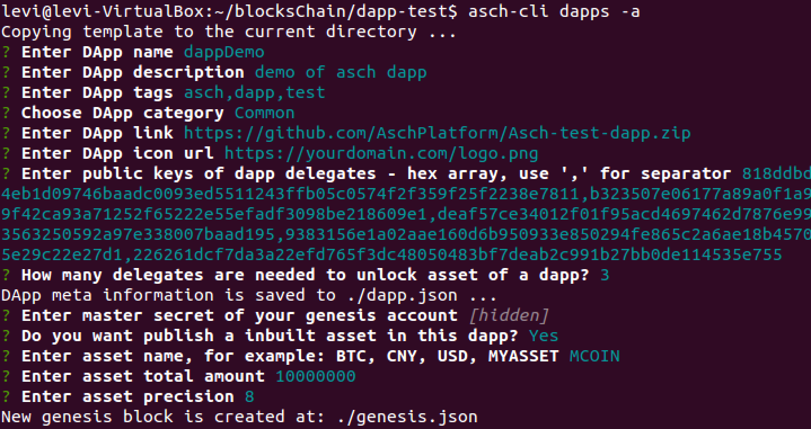

以下内容基于[官方HelloWorld文档](https://github.com/AschPlatform/asch/blob/master/docs/dapp_docs/1_hello.md)

### Asch三种网络类型
1. localnet: 运行在本地的私有链，用于开发者测试开发。只有一个节点。
2. testnet: Asch链公网测试环境，与mainnet功能基本等同，但magic不同。属于官方测试环境。
3. mainnet: Asch主网正式环境，即Asch区块链网络。

### Asch安装
系统：Linux Ubuntu 14.0.4 VB虚拟机  

1. 首先新建目录用于存放Asch源码及后续项目：`mkdir blocksChain`
2. 安装**Git**(Ubuntu 16不需此步骤)：`sudo apt-get install git`
3. 下载Asch源码：`git clone https://github.com/AschPlatform/asch.git`
4. 根据Asch源码中的`README.md`安装Asch（文档中安装Web Wallet步骤也需执行）
5. 运行app.js并从浏览器访问`localhost:4096`，若出现Asch钱包界面，则安装成功。
6. 安装asch-cli:`npm install -g asch-cli`（nvm及node在安装Asch源码过程中已安装，若错过此步骤需安装）

### 创建Asch Demo应用
创建dapp前需保证localnet已启动（访问localhost:4096成功）  

1. 创建受托人： ，截图中**5**为自定义的受托人数量。产生的数据需保存下来。  
2. 创建Dapp存放目录：`mkdir asch-demo && cd asch-demo`
3. 生成应用模板（**dapps**为子命令）`asch-cli dapps -a`  
4. 

有几个注意事项

1. DApp link是为了方便普通用户自动安装，必须以.zip结尾, 如果您的dapp不打算开源或者没有准备好，可以把这个选项当做占位符，它所在的地址不必真实存在
2. DApp icon url这是在阿希应用中心展示用的应用图标, 必须以.jpg或.png结尾，如果该图片无法访问，阿希应用中心会展示一个默认的图标
3. How many delegates ...这个选项表示从dapp跨链转账资产时需要多少个受托人联合签名，该数字必须大于等于3、小于等于你配置的受托人公钥个数且小于等于101，数字越大越安全，但效率和费用越高
4. Dapp的创世块中可以创建内置资产，但不是必须的，内置资产无法跨链转账，只能在链内使用。在主链发行的UIA（用户自定义资产）可以充值到任意dapp中，也可从dapp提现到主链，这是dapp内置资产和UIA最大的区别。“一链多币，一币多链”指的就是主链可以发行多个UIA，而每个UIA都可以充值到多个dapp中。

### 运行

1. 注册dapp时，教程解释需要向一个账户转账，由于使用了**localnet**，可以直接登录创世帐号`someone manual strong movie roof episode eight spatial brown soldier soup motor`向自己的帐号转需要的费用，即是`asch-cli registerdapp -f dapp.json -e "possible melt adapt spoon wing coyote found flower bitter warm tennis easily"`中帐号对应的**address**。保存返回的**id**。
2. 将整个**asch-demo项目**拷贝至`path/to/asch/dapps/`目录下，并将`asch-demo`更名为步骤一中获取的**id**。
3. 编辑项目中的`config.json`，将创建的受托人的secrets写入。
4. 重启asch节点，访问`localhost:4096/dapps/$id/`便可看到dapp。