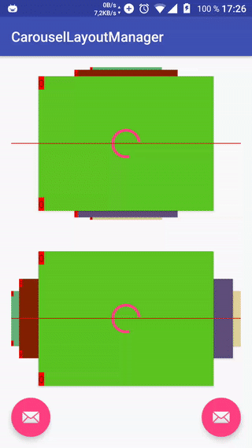
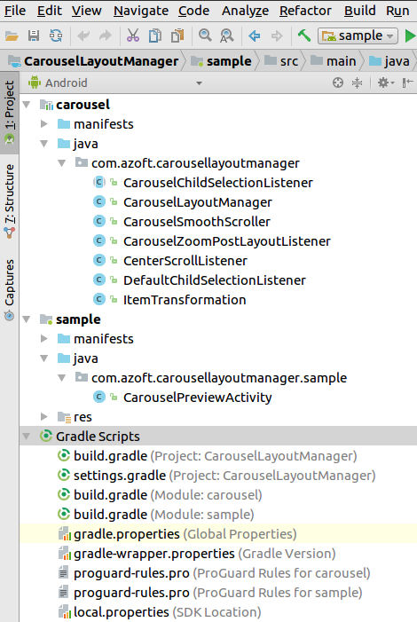

# CarouselLayoutManager简介
[CarouselLayoutManager](https://github.com/Azoft/CarouselLayoutManager)实现的是旋转木马样式的RecyclerView布局，使用非常简单，直接新建出来再通过`recyclerview.setLayoutManager()`设置进去就能实现效果了，实际效果如下：



红线时demo中作者添加的效果，实际使用不会出现。  
但是由于项目需要实现的效果与标准CarouselLayoutManager实现的效果稍有出入，比如标准效果水平转动时所有item的中心都是在一条直线上，但需求时左右两边的item中心相对于中间高一些，其余诸如item间距以及缩放比例在CarouselLayoutManager中都没有开放出相对应的接口进行修改。  
因此我们需要对源码进行一点修改以定制效果，也可以借此机会了解了自定义LayouManager的相关知识。

# 源码下载及导入
首先需要从github上clone下整个项目源码，如果对于自定义LayoutManager完全没有了解可以在等待clone完成的时候谷歌（或者百度）一下自定义LayoutManager的基础知识。  
clone完成后进入到项目文件夹可以看到实际上源码包含了**carousel**和**sample**两个项目，sample跑出来就是上面GIF图的效果，可以看看作者是怎么使用的或者用来查看修改后的效果，如果不感兴趣也可以直接打开carousel项目就行了。  
在导入整个项目时（我导入的时sample）会有个奇怪的问题时找不到`local.properties`文件，但这个文件实际上就在sample文件夹中，直接复制到项目根目录下再**build**就OK了。这是导入后的目录：  
如果是在项目中使用定制的CarouselLayoutManager只需要将`com.azoft.carousellayoutmanager`包下的代码全部复制进自己的项目就可以使用了。

# 源码分析
**源码中所有的英文注释都是Azoft大神自己的**  
sample里面的代码很简单，不再细看，我们就研究一下Azoft大神时怎么实现的旋木效果就行，只要知道原理再去定制自己想要的效果就比较容易了。  
实现旋木效果的主要的代码都在`CarouselLayoutManager.java`中，我们就从这个文件开始分析。  
`CarouselLayoutManager`直接继承自`RecyclerView.LayoutManager`，必须重写的方法是`generateDefaultLayoutParams()`方法，但这个方法是为了设置item的默认`LayoutParams`，一般设置为`RecyclerView.LayoutParams(ViewGroup.LayoutParams.WRAP_CONTENT, ViewGroup.LayoutParams.WRAP_CONTENT);`就好。  
而实现了旋木的主要工作都在`onLayoutChildren()`中，LayoutManager会在每次刷新时调用此函数，因此重写这个方法就可以实现任何布局以及滑动动画。
``` java
@Override
public void onLayoutChildren(@NonNull final RecyclerView.Recycler recycler, @NonNull final RecyclerView.State state) {
  //前面做了很多工作是与初始准备及滑动的距离测量有关的，我在定制中没有需要修改到这部分，还没有深入研究，将来补上
  ...
  //对item的绘制以及位置计算都放在了这里面
  fillData(recycler, state, childMeasuringNeeded);
}
```

`fillData()`函数内容：

``` java
private void fillData(@NonNull final RecyclerView.Recycler recycler, @NonNull final RecyclerView.State state, final boolean childMeasuringNeeded)
{
  final float currentScrollPosition = getCurrentScrollPosition();
  //这个函数中通过各种计算确定了显示的item数量以及摆放顺序，详细分析在下。
  generateLayoutOrder(currentScrollPosition, state);

  detachAndScrapAttachedViews(recycler);

  final int width = getWidthNoPadding();
  final int height = getHeightNoPadding();

  //这里针对不同的布局方向采用不同的位置计算方式，但最后都调用到了fillDataItem()中
  if (VERTICAL == mOrientation) {
    fillDataVertical(recycler, width, height, childMeasuringNeeded);
  } else {
    fillDataHorizontal(recycler, width, height, childMeasuringNeeded);
  }

  //这里以及上面的detachAndScrapAttachedViews()都是在做内存的清理工作。
  recycler.clear();
  detectOnItemSelectionChanged(currentScrollPosition, state);
}
```

`generateLayoutOrder()`函数比较重要了，Azoft在其中通过巧妙的方法实现了item之间层级的管理，代码分析如下：

``` java
private void generateLayoutOrder(final float currentScrollPosition, @NonNull final RecyclerView.State state) {
  mItemsCount = state.getItemCount();
  final float absCurrentScrollPosition = makeScrollPositionInRange0ToCount(currentScrollPosition, mItemsCount);
  final int centerItem = Math.round(absCurrentScrollPosition);

  if (mCircleLayout && 1 < mItemsCount) {
    /**
    *这里就比较坑了，mMaxVisible竟然时指的一边能看到的最大的数-1，
    *如果需要设置可见的最大数就需要在
    *调用CarouselLayoutManager的setMaxVisibleItems()时自己先计算好。
    *或者可以修改这个逻辑，将下句改为：
    *
    * final int layoutCount = Math.min(mLayoutHelper.mMaxVisibleItems, mItemsCount);
    *  
    *我改为这样也没遇到什么问题，所以还不太明白为什么要 *2 + 3,
    *毕竟MaxVisibleItems这个名称很有迷惑性，一般都会认为就是整个Recyclerview可见的Item数量吧。
    *如果你有其他想法也请不吝赐教。
    **/
    final int layoutCount = Math.min(mLayoutHelper.mMaxVisibleItems * 2 + 3, mItemsCount);// + 3 = 1 (center item) + 2 (addition bellow maxVisibleItems)

    //这里就是在mLayoutHelper中创建一个大小为layoutCount的数组保存item的摆放顺序
    mLayoutHelper.initLayoutOrder(layoutCount);

    //计算出每一边的item数量
    final int countLayoutHalf = layoutCount / 2;
    /**
    *下面两个for循环就是重点了，Azoft先向将左/上面的item依正序放入，再将右/下面的item以倒序放入，最后放入中间item
    *假如我们列表从左到右有5个item，他们在数组中的顺序时1 -> 2 -> 5 -> 4 -> 3
    *这样做的好处是在不支持Z轴的低版本Android中，也能实现越靠近中间的item层级越高，
    *因为android中后放置的view在前一个view上上面
    **/
    // before center item
    for (int i = 1; i <= countLayoutHalf; ++i) {
      //当循环打开时摆放item后面的元素可能实际位置是在它前面，因此需要处理
      final int position = Math.round(absCurrentScrollPosition - i + mItemsCount) % mItemsCount;
      mLayoutHelper.setLayoutOrder(countLayoutHalf - i, position, centerItem - absCurrentScrollPosition - i);
    }
    // after center item
    for (int i = layoutCount - 1; i >= countLayoutHalf + 1; --i) {
      final int position = Math.round(absCurrentScrollPosition - i + layoutCount) % mItemsCount;
      mLayoutHelper.setLayoutOrder(i - 1, position, centerItem - absCurrentScrollPosition + layoutCount - i);
    }
    mLayoutHelper.setLayoutOrder(layoutCount - 1, centerItem, centerItem - absCurrentScrollPosition);

  } else {
    ...
  }
```

`generateLayoutOrder()`中确定了即将显示出来的item以及他们的加入顺序，接下来就要进入到内容填充了，
我们假设`orentation`为`hrizontal`继续分析：

``` java
private void fillDataHorizontal(final RecyclerView.Recycler recycler, final int width, final int height, final boolean childMeasuringNeeded) {
  /**
  *由于横向布局时中心高度不变，因此直接计算得出。
  *Azoft是根据setScale实现缩放的，因此item的width和height并不会变，不用担心计算结果不同
  *如果要实现中心高度不一致，不建议直接在这里修改，后面会提到另一个方法。
  *如果一定要在这里修改需要注意根据不同Position计算出相应的值，毕竟全部提高50dp等于没有提高。
  **/
  final int top = (height - mDecoratedChildHeight) / 2;
  final int bottom = top + mDecoratedChildHeight;

  final int centerViewStart = (width - mDecoratedChildWidth) / 2;

  for (int i = 0, count = mLayoutHelper.mLayoutOrder.length; i < count; ++i) {
    final LayoutOrder layoutOrder = mLayoutHelper.mLayoutOrder[i];
    /**
    *这个函数时根据item的位置计算出了它们相对于中心的偏移距离，
    *如果认为item之间距离不合适可以修改这个函数的计算逻辑
    *内容很简单就不进去分析了，Azoft使用了Math.round()及Math.signum()计算结果，保证了中心的item不会有偏移，修改水平的偏移可以参考这个函数的思路。
    **/
    final int offset = getCardOffsetByPositionDiff(layoutOrder.mItemPositionDiff);
    final int start = centerViewStart + offset;
    final int end = start + mDecoratedChildWidth;
    //这个函数就是onLayoutChildren()的尽头了，里面完成了展示工作。
    fillChildItem(start, top, end, bottom, layoutOrder, recycler, childMeasuringNeeded);
  }
}
```
我们进入`fillChidrenItem()`中：

``` java
private void fillChildItem(final int start, final int top, final int end, final int bottom, @NonNull final LayoutOrder layoutOrder, @NonNull final RecyclerView.Recycler recycler, final int i, final boolean childMeasuringNeeded) {
  //创建出view并加入
  final View view = bindChild(layoutOrder.mItemAdapterPosition, recyclerchildMeasuringNeeded);
  //这里设置了view的层级，但是由于我们时按照特殊顺序创建的itemView，这一句并不必要
  ViewCompat.setElevation(view, i);
  ItemTransformation transformation = null;
  if (null != mViewPostLayout) {
    /**
    *当ViewPostLayout不为空时获取动画效果，这个没有默认值，需要调用
    * CarouselLayoutManager.setPostLayoutListener()
    *手动设置，但Azoft已经实现了一个动画效果，就在CarouselZoomPostLayoutListener.java中
    *sample中也是使用了这个PostListener，如果我们需要定制CarouselLayoutManager，基本上参考这个就行了。
    **/
    transformation = mViewPostLayout.transformChild(view, layoutOrder.mItemPositionDiff, mOrientation);
  }
  //下面就没有什么好说的了，将前面计算出的数据设置给子item，完成了整个绘制过程。
  if (null == transformation) {
    view.layout(start, top, end, bottom);
  } else {
    view.layout(Math.round(start + transformation.mTranslationX), Math.round(top + transformation.mTranslationY),
      Math.round(end + transformation.mTranslationX), Math.round(bottom + transformation.mTranslationY));

    ViewCompat.setScaleX(view, transformation.mScaleX);
    ViewCompat.setScaleY(view, transformation.mScaleY);
  }
}
```

因此我们最后看看`CarouselZoomPostLayoutListener.java`：

``` java
public class CarouselZoomPostLayoutListener implements CarouselLayoutManager.PostLayoutListener {

    @Override
    public ItemTransformation transformChild(@NonNull final View child, final float itemPositionToCenterDiff, final int orientation) {
      /**
      *这个计算缩放的方法把我看懵了，最后用软件画出来就是一个相对Y轴对称的山包样式，要修改缩放梯度也很简单，
      *只需要将itemPositionToCenterDiff乘以或者除以一个比例就行了。
      **/
        final float scale = (float) (2 * (2 * -StrictMath.atan(Math.abs(itemPositionToCenterDiff) + 1.0) / Math.PI + 1));

        // because scaling will make view smaller in its center, then we should move this item to the top or bottom to make it visible
        //其实就是在缩放后修正view的位置，让它再次居中，因为缩放并非以view的中心为锚点。所以如果需要将两侧的view上移或者下移修改这里就好了
        final float translateY;
        final float translateX;
        if (CarouselLayoutManager.VERTICAL == orientation) {
            final float translateYGeneral = child.getMeasuredHeight() * (1 - scale) / 2f;
            translateY = Math.signum(itemPositionToCenterDiff) * translateYGeneral;
            translateX = 0;
        } else {
            final float translateXGeneral = child.getMeasuredWidth() * (1 - scale) / 2f;
            translateX = Math.signum(itemPositionToCenterDiff) * translateXGeneral;
            translateY = 0;
        }
        return new ItemTransformation(scale, scale, translateX, translateY);
    }
}
```
至此我们就大概梳理完了CarouselLayoutManager的流程，但是通过目前这些我们已经可以去订制CarouselLayoutManager了。

# 坑
由于我们是通过另类的顺序加入的view，因此直接调用recyclerview.getChildAt()获取到的view可能并非你希望得到的想要的（当然就算时普通recyclerview也可能不是），因此使用Azoft实现的一个监听器，可以直接使用。
如果你设定了循环模式，那么还有一个更简单的解决的方法。我们的放入顺序决定了当前被选中的（中间的View）一定是第`recyclerview.getChildCount()-1`个，也就是最后一个，因此可以直接通过`recyclerview.getChildAt(recyclerview.getChildCount()-1)`就可以获取到被选中的view。

# 以上
在阅读源码的过程中一开始真的无从下手，光是`CarouselLayoutManager.java`就有800多行代码，那么多方法和内部类，一行一行地看很快就头晕眼花了，但是在了解了LayoutManager原理以及绘制过程后，根据流程一步一步走，思路就慢慢清晰了起来。  
第一次写源码分析，在编写过程中发现自己还是有很多没弄懂的地方，整个文章写完又学习到不少东西，但是可能写得很乱，如有任何问题或者建议请直接留言、邮件、QQ垂询。
